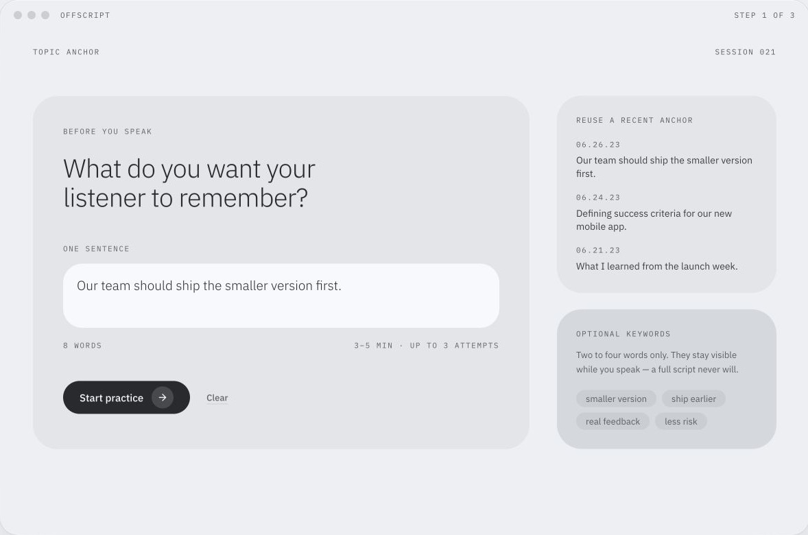
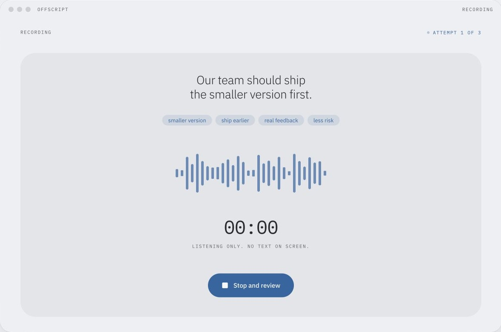
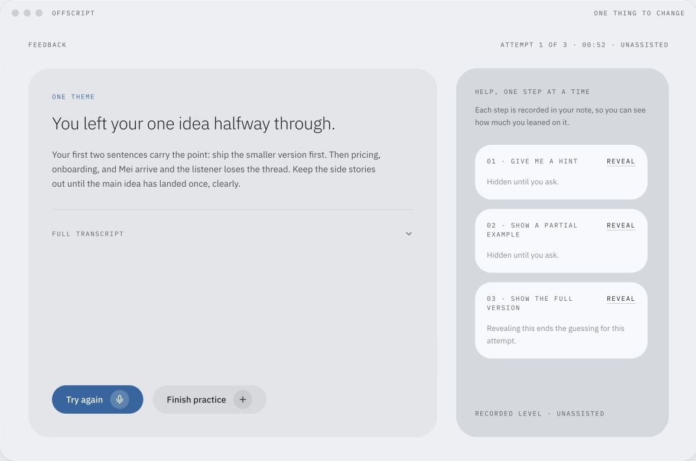
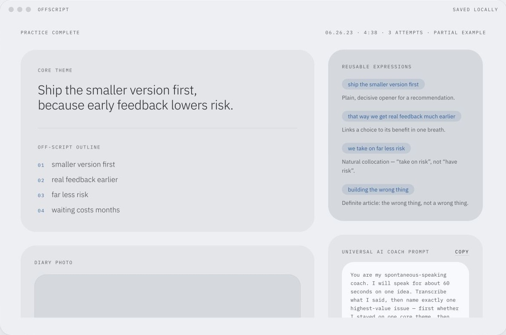
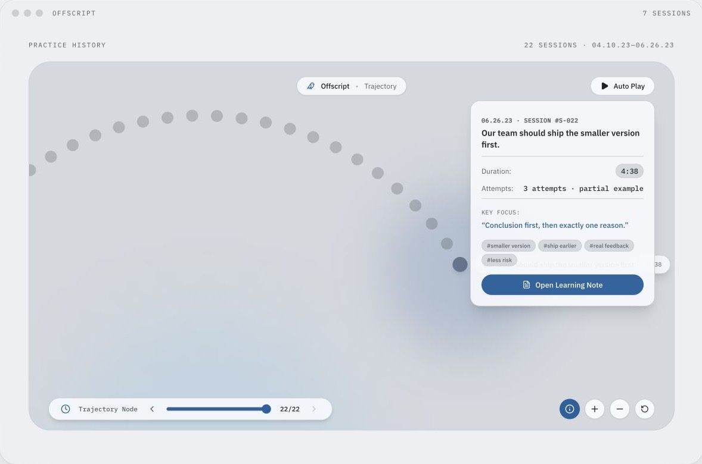

  

<h1 align="center">Offscript</h1>

  A voice-first macOS practice tool for saying one clear thing in English without reading from a script.

  <a href="https://github.com/waitingkawa/off-script/releases/tag/v0.1.0"><strong>Download for macOS</strong></a>
  &nbsp;·&nbsp;
  <a href="https://github.com/waitingkawa/off-script/releases">Release notes</a>

  macOS 14+ · Apple Silicon and Intel · Pre-release

## Speak first. Edit second.

Offscript starts with one question: **What do you want your listener to remember?**

Write a single-sentence anchor, then speak before seeing a transcript. After each attempt, the coach picks one problem worth fixing and asks you to try again. A session lasts three to five minutes and stops after three attempts.

<table>
  <tr>
    <td width="50%"></td>
    <td width="50%"></td>
  </tr>
  <tr>
    <td align="center">Speak from a topic anchor and a few keywords.</td>
    <td align="center">Fix one thing, then say it again.</td>
  </tr>
</table>

## Help appears only when you ask

The full rewrite stays folded away. If you get stuck, reveal a hint, a partial example, or the complete version. Offscript records how much help you used so the note reflects what you could say on your own.

<table>
  <tr>
    <td width="50%"></td>
    <td width="50%"></td>
  </tr>
  <tr>
    <td align="center">Keep the anchor, outline, improvement, and reusable phrases.</td>
    <td align="center">Each dot is one finished three-to-five-minute practice.</td>
  </tr>
</table>

## Designed to stay quiet

The interface uses soft geometry, generous space, warm grays, and one muted accent color for recording, the current attempt, and language worth remembering. The screenshots above come from the interaction prototype that guided the native build.

The macOS app keeps the platform behavior intact:

- a menu-bar entry and a separate practice window
- keyboard controls for starting a session, opening history, and recording
- local practice history with SwiftData
- API keys stored in macOS Keychain
- Markdown export and a reusable prompt for ChatGPT, Claude, or another AI coach

## Install

1. Download [Offscript-0.1.0-macOS.dmg](https://github.com/waitingkawa/off-script/releases/download/v0.1.0/Offscript-0.1.0-macOS.dmg).
2. Open the disk image and drag Offscript into Applications.
3. Control-click Offscript and choose **Open** on the first launch. This preview is ad-hoc signed and has not been notarized yet.
4. Add an OpenAI or Gemini API key in Settings. The key is saved in Keychain, not in the project files.

## Built with

- SwiftUI and native macOS windows
- SwiftData for sessions and Learning Notes
- AVFoundation for recording and metering
- Keychain Services for provider credentials
- OpenAI or Gemini for transcription and coaching

The web prototype remains a visual and interaction reference. The desktop app does not embed it in a WebView.

## Shortcuts

| Action | Shortcut |
| --- | --- |
| New practice | ⌘N |
| Practice history | ⌘⇧H |
| Settings | ⌘, |
| Start or stop recording | ⌥R |

## Privacy

Practice history stays on your Mac. Audio is sent only when you start an AI-assisted attempt, and the temporary local recording is deleted after the provider request finishes. Provider data policies still apply.
